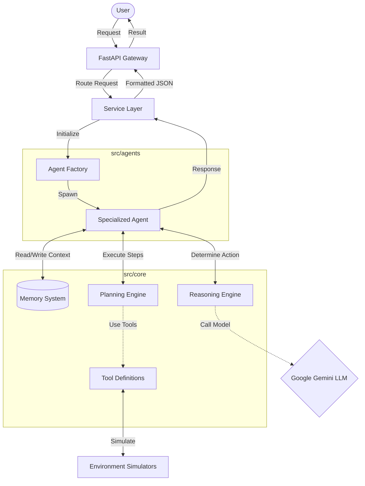

# 🤖 Agentic AI Project Template (Google ADK + uv)

A production-grade Cookiecutter template for building scalable, autonomous AI agents using **Google's Agent Development Kit (ADK)** and **uv** for blazing-fast dependency management.

This template scaffolds a "Fractal" project structure designed for complex multi-agent systems, separating agent behaviors (`src/agents`) from cognitive architecture (`src/core`).

## 🚀 Features

* **⚡ uv Integration:** Pre-configured `pyproject.toml` for instant dependency resolution and locking.
* **✨ Code Quality:** Pre-commit hooks (`ruff`, `ruff-format`) for fast formatting and linting.
* **🧠 Cognitive Architecture:** Dedicated modules for `memory`, `planning`, and `reasoning` to support advanced agent patterns (ReAct, ToT).
* **🏗️ Production Structure:** Clearly separates `configs`, `data`, and source code (`src`) to avoid "script sprawl."
* **🔒 API Security & Config:** Comprehensive `.env.example` and backend security setup to prevent leaks and unauthorized access.
* **🐳 Docker Assets:** Includes a `Dockerfile` and `docker-compose.yml` for containerizing and orchestrating your agents.
* **🚀 FastAPI Backend:** High-performance, async-ready REST API skeleton for serving your agents.
* **🧪 Testing Infrastructure:** Ready-to-use `pytest` suite for unit and integration testing.
* **🔄 CI/CD Ready:** Automated GitHub Actions workflows for continuous integration.
* **✅ Automated Setup:** Post-generation hooks automatically initialize Git and install dependencies.

## �️ Tech Stack

* **Language:** Python 3.10+
* **LLM Engine:** Google Gemini (via `google-genai` SDK)
* **Framework:** FastAPI (Backend), Pydantic (Validation)
* **Package Management:** uv
* **Code Quality:** Ruff, pre-commit
* **Testing:** Pytest
* **Containerization:** Docker, Docker Compose

## 🏗️ Technical Architecture / System Logic flow



## �📂 Project Structure

Your generated project will look like this:

```text
my_agent_project/
├── .github/                # CI/CD workflows
├── config/                 # Configuration files (YAML) for agents & models
├── data/                   # Local storage for logs, memory, and knowledge bases
├── src/
│   ├── agents/             # Agent logic
│   │   ├── base/           # Abstract base classes
│   │   └── specialized/    # Concrete agent implementations
│   ├── backend/            # FastAPI application
│   │   ├── api/            # API routes (v1)
│   │   ├── core/           # App configuration & security
│   │   ├── schemas/        # Pydantic models
│   │   └── services/       # Business logic layer
│   ├── core/               # Shared cognitive architecture
│   │   ├── memory/         # Long-term & short-term memory systems
│   │   ├── planning/       # Planning algorithms (e.g., Tree of Thoughts)
│   │   ├── reasoning/      # Reasoning engines (e.g., Chain of Thought)
│   │   └── tools/          # Tool definitions & integrations
│   ├── environment/        # Simulation environments
│   │   ├── simulators/     # External world simulators
│   │   └── benchmarks/     # Evaluation scenarios
│   └── utils/              # Helper functions
│       ├── logging/        # Structured logging configuration
│       └── helpers/        # Miscellaneous utilities
├── tests/                  # Pytest suite
├── .env.example            # Template for environment variables (API keys, security configs)
├── .pre-commit-config.yaml # Pre-commit hooks configuration
├── docker-compose.yml      # Orchestration configuration
├── pyproject.toml          # Python dependencies (managed by uv)
└── Dockerfile              # Deployment configuration
```

## 🛠️ Prerequisites

Install **uv** (The modern Python package manager):

```bash
curl -LsSf https://astral.sh/uv/install.sh | sh
```

Install **cookiecutter**:

```bash
uv tool install cookiecutter
```

## ⚡ Quick Start

### 1. Generate a New Project

Run this single command to pull the template and scaffold your new agent:

```bash
# Generate from GitHub (Recommended)
uvx cookiecutter https://github.com/YOUR_USERNAME/ai-agent-template.git

# OR Generate locally if you cloned this repo
uvx cookiecutter .
```

You will be prompted for:

* `project_name`: (e.g., "Newsroom Agents")
* `author_name`: (Your Name)

### 2. Configure Environment

Enter your new project folder and set up your API keys:

```bash
cd newsroom_agents
cp .env.example .env
nano .env  # Add your GOOGLE_API_KEY here
```

### 3. Run the Base Agent

The project comes with a pre-configured "Hello World" agent to verify your setup.

```bash
uv run src/agents/base_agent.py
```

### 4. Run the Backend

```bash
uv run uvicorn src.backend.main:app --reload
```

## 📦 Dependency Management

This project uses **uv** for all package management.

* Add a package: `uv add pandas`
* Run a script: `uv run python script.py`
* Sync dependencies: `uv sync`

## 🤝 Contributing

Contributions are welcome! Please open an issue or submit a pull request if you have ideas for improving the agent architecture.

## 📄 License

MIT
