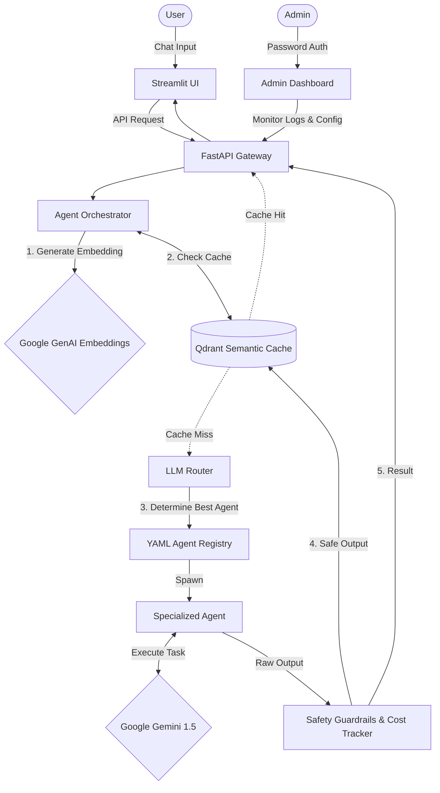

# 🤖 Enterprise Agentic AI Project Template

A true production-grade Cookiecutter template for building scalable, autonomous, and safe AI agents using **Google's Agent Development Kit (ADK)** and **uv**.

Most AI tutorials leave you with a fragile Python script. This template provides a robust, **5-Layer Enterprise Tech Stack** out-of-the-box, ensuring your agents are ready for real-world users, massive scale, and strict cost controls.

## 🌟 Why Use This Template?

Transitioning an AI agent from a "cool prototype" to a "production service" requires months of boilerplate. This template solves the hardest enterprise challenges instantly:

* **Cost Control:** Built-in semantic caching and real-time token tracking prevent LLM bill shock.
* **Safety First:** Integrated I/O guardrails prevent your agents from leaking secrets or generating banned content.
* **Extensibility:** Add new specialized agents without touching core code—just declare them in a YAML file.
* **Observability:** A dedicated Admin Dashboard lets you view agent states, system logs, and hit rates in real-time.
* **Bulletproof Infrastructure:** Ready-to-deploy Docker Compose and Kubernetes (K8s) manifests.

---

## 🏗️ The 5-Layer Enterprise Architecture

We implement the industry-standard architecture for AI applications:

1. **🖥️ Interface Layer:** Dual Streamlit frontends (a User Chat interface and a secure Admin Dashboard).
2. **🧠 Orchestration Layer:** A dynamic `AgentFactory` (YAML registry) and an LLM-powered router for smart multi-agent handoffs.
3. **🛡️ LLM Layer:** Middleware for `Guardrails` (content safety) and `LLMMonitor` (token usage/cost calculation).
4. **💾 Data Layer:** Qdrant Vector Database configured for **Semantic Caching** to eliminate redundant LLM calls.
5. **⚙️ Infrastructure Layer:** FastAPI backend, Loguru structured tracing (with trace-IDs), Docker, and high-availability Kubernetes manifests.

### System Logic Flow


```mermaid
graph TD
    User([User]) -->|Chat Input| UI[Streamlit UI]
    UI -->|API Request| Gateway[FastAPI Gateway]
    
    Gateway --> Orchestrator[Agent Orchestrator]
    
    Orchestrator -->|1. Generate Embedding| Embedding{Google GenAI Embeddings}
    Orchestrator <-->|2. Check Cache| Cache[(Qdrant Semantic Cache)]
    
    Cache -.->|Cache Hit| Gateway
    
    Cache -.->|Cache Miss| Router[LLM Router]
    Router -->|3. Determine Best Agent| Registry[YAML Agent Registry]
    Registry -->|Spawn| Agent[Specialized Agent]
    
    Agent <-->|Execute Task| LLM{Google Gemini 1.5}
    
    Agent -->|Raw Output| Guardrails[Safety Guardrails & Cost Tracker]
    Guardrails -->|4. Safe Output| Cache
    Guardrails -->|5. Result| Gateway
    
    Gateway --> UI
    
    Admin([Admin]) -->|Password Auth| AdminUI[Admin Dashboard]
    AdminUI -->|Monitor Logs & Config| Gateway

```

---

## 📂 Project Structure

```text
my_agent_project/
├── .github/                # CI/CD workflows with security linting
├── config/
│   └── agent_config.yaml   # Registry to easily add/remove agents
├── k8s/                    # Production Kubernetes deployments & services
├── src/
│   ├── agents/             # Agent logic
│   │   ├── base/           # Dynamic AgentFactory
│   │   └── specialized/    # Concrete agents (Researcher, Writer, etc.)
│   ├── backend/            # FastAPI application
│   │   ├── core/           # Security & settings (.env parsing)
│   │   └── services/       # Caching, Guardrails, and Orchestration
│   ├── interface/          # Streamlit UI
│   │   ├── app.py          # End-user Chat Application
│   │   └── admin.py        # Secure Admin/Monitoring Dashboard
├── tests/                  # Pytest suite
├── .env.example            # Environment variables template
├── docker-compose.yml      # Multi-container orchestration
├── pyproject.toml          # Blazing fast dependencies managed by uv
└── Dockerfile              # App containerization

```

---

## ⚡ Quick Start

### 1. Prerequisites

Install [uv](https://github.com/astral-sh/uv), the modern Python package manager:

```bash
curl -LsSf [https://astral.sh/uv/install.sh](https://astral.sh/uv/install.sh) | sh
uv tool install cookiecutter

```

### 2. Generate Your Project

```bash
uvx cookiecutter [https://github.com/YOUR_USERNAME/ai-agent-template.git](https://github.com/YOUR_USERNAME/ai-agent-template.git)
# Follow the prompts to name your project

```

### 3. Configure the Environment

```bash
cd your_project_name
cp .env.example .env
# Edit .env and add your GOOGLE_API_KEY and change the ADMIN_PASSWORD

```

### 4. 🐳 The Recommended Way: Docker Compose

Because this project utilizes a Vector DB (Qdrant) and a separate frontend/backend, Docker is the easiest way to launch the full stack.

```bash
docker-compose up --build

```

* **User Chat UI:** `http://localhost:8502`
* **Admin Dashboard:** `http://localhost:8501`
* **FastAPI Docs:** `http://localhost:8000/docs`

### 5. Local Development (Without Docker)

If you prefer running scripts locally, ensure you start a local Qdrant instance, then run:

```bash
# Sync dependencies
uv sync

# Terminal 1: Start Backend
uv run uvicorn src.backend.main:app --reload

# Terminal 2: Start User UI
uv run streamlit run src.interface.app.py

# Terminal 3: Start Admin Dashboard
uv run streamlit run src.interface.admin.py

```

---

## ☸️ Production Deployment (Kubernetes)

This template is ready for high-availability enterprise environments. The `k8s/` directory contains manifests with properly configured ConfigMaps, Secrets, and Readiness Probes.

1. **Build and push your Docker images** to your container registry.
2. **Update the image URIs** in `k8s/02-backend.yaml` and `k8s/03-frontend.yaml`.
3. **Set your production secrets** in `k8s/01-config.yaml`.
4. **Deploy:**

```bash
kubectl apply -f k8s/

```

*Note: The Admin Dashboard service is set to `ClusterIP` for security. To access it, use port forwarding:*

```bash
kubectl port-forward svc/admin-service 8501:8501 -n YOUR_PROJECT_NAMESPACE-prod

```

## 🤝 Contributing

Contributions, issues, and feature requests are welcome! Let's make building enterprise AI agents accessible to everyone.

## 📄 License

MIT
